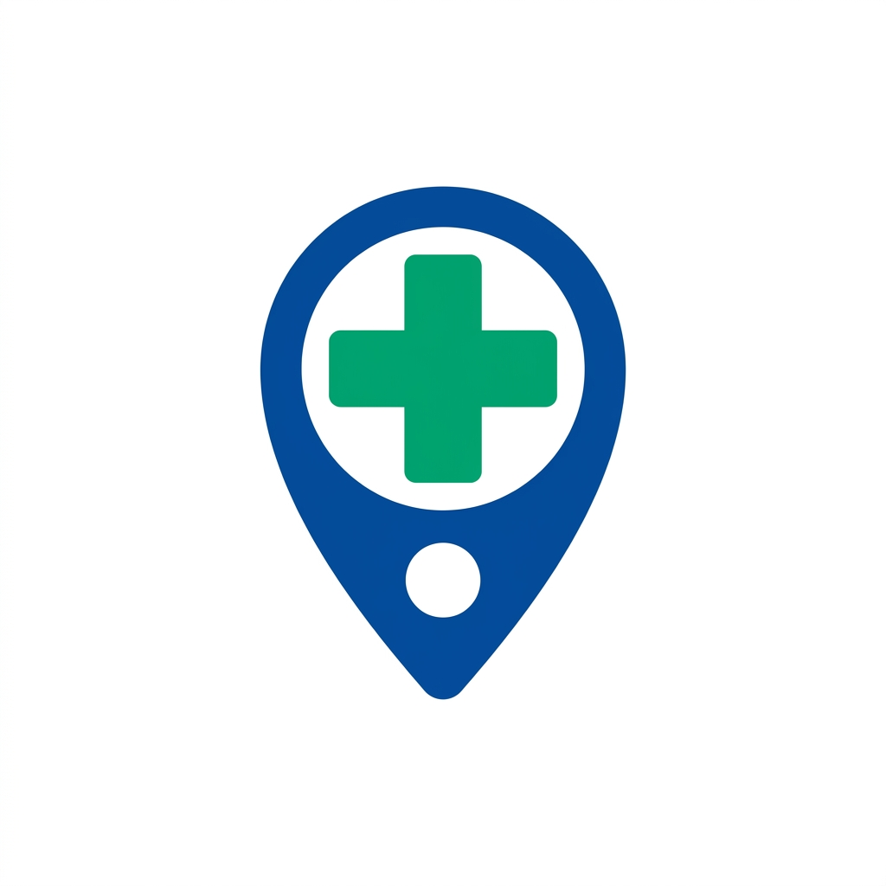

  

# MarunnUndo (മരുന്നുണ്ടോ?)

* check it out at : https://marunnundo.vercel.app

Basically, getting medicines quickly when there is an emergency can be a big headache, especially if you are in a new place. You have to run around asking multiple shops if a specific medicine is in stock. To solve this problem, we created MarunnUndo. 

It is a very simple web application made specifically for people in Kerala. What it does is actually quite straightforward: you just open the website, and it will immediately show you all the medical shops and pharmacies near your current location on a map. 

If you need a specific medicine, you can just type the name, and the app will generate a WhatsApp message for you. You can directly send this message to the medical shop owner to ask if they have the stock before you actually travel there.

### Main Features

* Find Nearby Shops: Click one button and see all the pharmacies within a 5 kilometer radius of where you are standing right now.
* Simple and Clean Design: We kept the design very minimal with a blue and white theme so that it is easy to read, even for older people.
* Works Fast: Since the website runs directly on your phone or laptop browser without any heavy background servers, it loads very fast even on slow mobile networks.

### How to use the code

If you are a developer looking to run this project on your own laptop, 

1. Just download or clone this folder to your computer.
2. Double click the `index.html` file to open it in Chrome or any browser.
3. Allow the location permission when the browser asks, and you are good to go.

